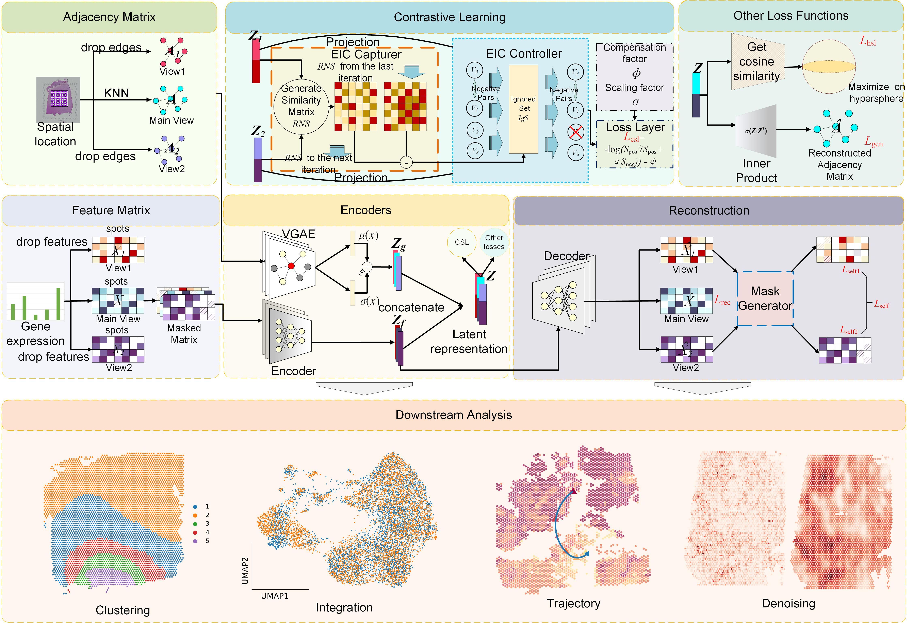

# stCAMBL:Biased Multi-view Contrastive Learning with Attentive Masking for Spatial Transcriptomic Analysis
## Overview:

__stCAMBL__ uses three views to construct the contrastive learning framework. Every view utilises a masked autoencoder with special masking strategies to learn a a low-dimensional expression and a variational graph autoencoder to acquire its spatial information. After that, various loss functions are added to improve the model's ability of unsupervised clustering. The embedding produced by stCAMBL can be used for batch integration, clustering and pseudotime trajectory analysis, etc. The reconstructed results can be used for signal strengthening, etc.

## Requirements:
 
stCAMBL is implemented in the pytorch framework. Please run stCAMBL on CUDA for faster training speed. The following packages are required to be able to run everything in this repository (see environment.yaml for details):

include
```
​​python​​: 3.8.0 
​​torch​​: 1.8.1+cu111 
​​cudnn​​: 9.1.0.70 
​​numpy​​: 1.22.4 
​​scanpy​​: 1.9.8 
​​anndata​​: 0.9.2 
​​rpy2​​: 3.5.12 
​​pandas​​: 2.0.3 
​​scipy​​: 1.10.1 
​​scikit-learn​​: 1.3.2
```

## Tutorial
Tutorials can be found here:  https://stcambl.readthedocs.io/en/latest/

## Citation:

...
**This repository contains the source code for the paper:**

