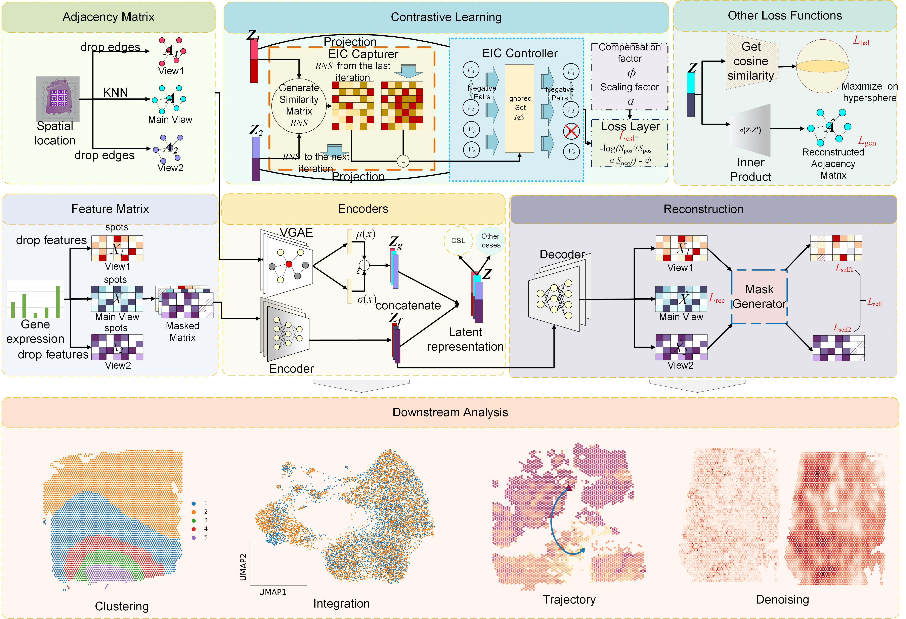

.. S3RL documentation master file, created by
   sphinx-quickstart on Wed Apr 16 19:43:51 2025.
   You can adapt this file completely to your liking, but it should at least
   contain the root `toctree` directive.

S3RL – Separable Spatial Single-cell Transcriptome Representation Learning via Graph Transformer and Hyperspherical Prototype Clustering
=============================================================================

.. toctree::
   :maxdepth: 1

   Installation_pyG
   Tutorial-DLPFC
   Tutorial-Nanostring
   Tutorial-Mouse_Brain_Anterior
   Tutorial-Human_Breast_Cancer
   T6_L-R_pairs

News
========
2025.04.10 S3RL is now available on GitHub at https://github.com/AI4Bread/stCAMBL.  
stCAMBL is implemented based on PyTorch Geometric (pyG) and supports efficient training and flexible batch processing for large-scale spatial transcriptomics datasets.  

The model provides enhanced spatial representation learning through the use of a Graph Transformer architecture and hyperspherical prototype clustering for clear domain separation.  
Please refer to Tutorials 1-5 for training strategies and batch processing guidance.

Introduction
========
Spatial transcriptomics (ST) enables the simultaneous measurement of gene expression and spatial context, offering unprecedented insights into tissue architecture and cellular communication. 
However, existing approaches often fail to jointly capture spatial topology and transcriptional heterogeneity, leading to suboptimal representations and limited biological interpretability. 
To address this limitation, we propose \textbf{stCAMBL}, a biased multi-view contrastive framework that integrates spatial graph structure modeling with attentive feature masking and partial contrastive regularization. 
Built upon a variational graph autoencoder backbone, stCAMBL learns biologically informed and noise-robust embeddings by adaptively emphasizing informative molecular features while mitigating confounding patterns across spatial domains. 
Comprehensive evaluations on multiple 10x Visium datasets demonstrate that stCAMBL substantially improves clustering accuracy, gene ontology enrichment, and signal restoration, providing a generalizable foundation for high-fidelity spatial transcriptomic analysis.

Citation
========
Fu, Laiyi, Wenkai Cui, Yifan Chen, Danyang Wu* and Hequan Sun*.  
*stCAMBL: Biased Multi-view Contrastive Learning with Attentive Masking for Spatial Transcriptomic Analysis.* *in review*, 2025.

