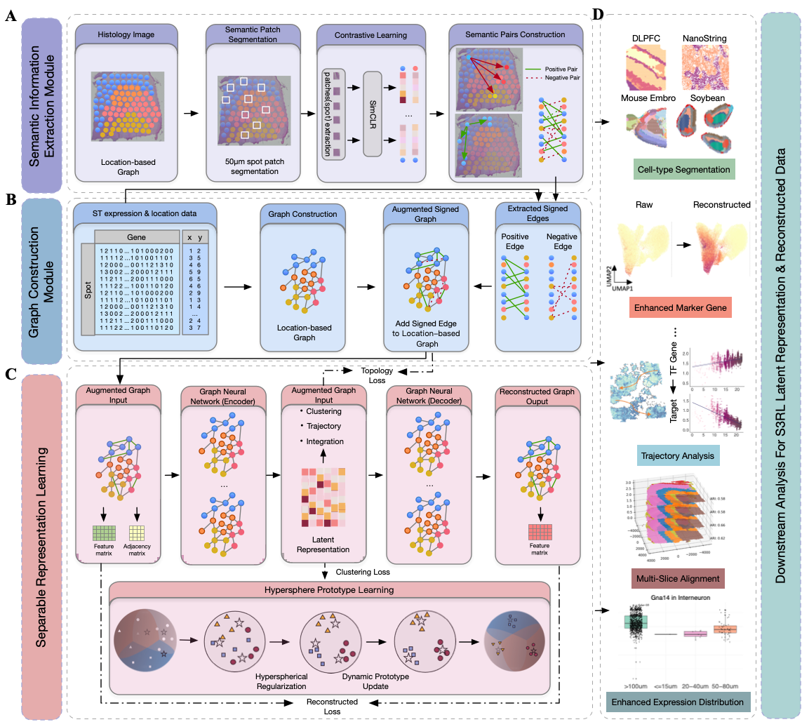

.. S3RL documentation master file, created by
   sphinx-quickstart on Wed Apr 16 19:43:51 2025.
   You can adapt this file completely to your liking, but it should at least
   contain the root `toctree` directive.

S3RL – Separable Spatial Single-cell Transcriptome Representation Learning via Graph Transformer and Hyperspherical Prototype Clustering
=============================================================================

.. toctree::
   :maxdepth: 1

   Installation_pyG
   Tutorial-DLPFC
   Tutorial-Nanostring
   Tutorial-Mouse_Brain_Anterior
   Tutorial-Human_Breast_Cancer
   T6_L-R_pairs

News
========
2025.04.10 S3RL is now available on GitHub at https://github.com/AI4Bread/S3RL.  
S3RL is implemented based on PyTorch Geometric (pyG) and supports efficient training and flexible batch processing for large-scale spatial transcriptomics datasets.  

The model provides enhanced spatial representation learning through the use of a Graph Transformer architecture and hyperspherical prototype clustering for clear domain separation.  
Please refer to Tutorials 1-5 for training strategies and batch processing guidance.

Introduction
========
Spatial transcriptomics enables the exploration of cell types, spatial domain organization, and cell–cell communication at tissue scale, serving as a powerful link between tissue morphology and molecular function. However, existing methods still struggle with limited spatial resolution, poor robustness in multi-slice alignment, and suboptimal ligand-receptor (L-R) detection in complex tissues. To address these challenges, we propose S3RL (Separable Spatial Single-cell Representation Learning), a unified framework that integrates gene expression, spatial coordinates, and histological image features via a graph neural network and hyperspherical prototype-based separable representation learning. In spatial clustering tasks, S3RL improves the Adjusted Rand Index (ARI) by over 52\% on the Nanostring lung cancer dataset and over 26\% on the 10X DLPFC dataset compared to state-of-the-art methods. For multi-slice spatial alignment, S3RL achieves an average ARI improvement of over 65.4\% in partial brain slices and over 48.3\% in complete slices relative to GraphST, highlighting its superior robustness and alignment consistency across heterogeneous spatial inputs. Moreover, S3RL reveals more biologically meaningful ligand-receptor signaling relationships, enhancing the interpretability of cell-cell communication patterns. Together, these results demonstrate S3RL’s effectiveness in enhancing spatial resolution, cell type identification, and biological insight across diverse spatial transcriptomics datasets.

Citation
========
Fu, Laiyi†, Penglei Wang†, Gaoyuan Xu†, Jitao Lu, Hequan Sun, and Danyang Wu*.  
*S3RL: Separable Spatial Single-cell Transcriptome Representation Learning via Graph Transformer and Hyperspherical Prototype Clustering.* *in review*, 2025.
